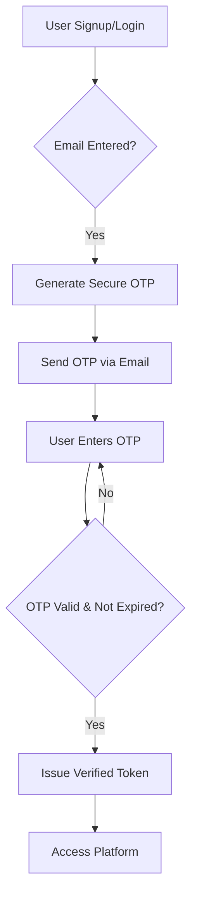

# Academic Debate Platform

A premium, full-stack platform designed to facilitate structured, real-time academic debates between students and professionals. The platform fosters civil discourse through moderated rooms, real-time argument flows, and a merit-based gamification system.

---

## 🎯 Purpose & Vision

In an era of rapid information exchange, the **Academic Debate Platform** aims to provide a controlled environment for intellectual growth. By separating emotional response from logical argumentation, the platform encourages users to:
- Practice critical thinking through Pro/Con positioning.
- Engage with verified professionals and peer students.
- Participate in a transparent voting system to determine the most persuasive arguments.
- Earn recognition through a points-based leaderboard.

---

## 🚀 How It Works

The platform operates on a real-time event-driven architecture, ensuring that debates are as dynamic as in-person academic tournaments.

### 1. Secure Authentication
To ensure the integrity of the community, all users must verify their identity via an OTP (One-Time Password) system. This prevents bot spam and ensures every participant is linked to a verified email address.

### 2. Debate Lifecycle
Debates are managed through three distinct phases:
- **Upcoming**: Moderators schedule topics and participants join their respective sides.
- **Live**: The room opens for real-time arguments, rebuttals, and audience interaction.
- **Completed**: The debate concludes, votes are tallied, and results are archived for the community to review.

### 3. Argument Structure
Unlike a standard chat room, the debate room is split. Only the assigned **Pro** and **Con** participants can post in the primary argument sections, while the audience engages via live chat and real-time voting.

---

## 📊 System Workflows

### Authentication Flow


### Debate Participation Flow

```mermaid
graph LR
    A[Moderator Creates Debate] --> B[Upcoming Phase]
    B --> C[Participants Join Pro/Con]
    C --> D[Live Phase Starts]
    D --> E[Pro/Con Present Arguments]
    E --> F[Audience Votes & Chats]
    F --> G[End Time Reached]
    G --> H[Debate Completed]
    H --> I[Points Awarded]
```


---

## 👥 User Roles & Permissions

| Role | Capabilities |
| :--- | :--- |
| **Moderator** | Create/Edit/Delete debates, manage room status, and oversee quality. |
| **Professional** | Join debates as Pro/Con, present high-level arguments, and mentor students. |
| **Student** | Join debates as Pro/Con, participate in audience voting, and climb the leaderboard. |
| **Other** | Spectate debates, participate in audience chat, and vote for the winner. |

---

## 🛠 Tech Stack

- **Frontend**: React.js with Vite, styled with a premium minimalist aesthetic.
- **Backend**: Node.js & Express using a modular controller-service architecture.
- **Real-Time**: Socket.io for instant argument delivery and live voting updates.
- **Security**: JWT for session management and Bcrypt for data hashing.
- **Database**: MongoDB Atlas for flexible, document-based storage.

---

## ⚙️ Getting Started

### Prerequisites
- Node.js (v18+)
- MongoDB Atlas Account
- SMTP Service (e.g., Gmail App Password)

### Installation
1. **Clone the Repository**
2. **Backend Setup**:
   ```bash
   cd backend
   npm install
   # Create a .env file based on .env.example
   npm run dev
   ```
3. **Frontend Setup**:
   ```bash
   cd frontend
   npm install
   npm run dev
   ```

---
© 2024 Academic Debate Platform. Fostering the leaders of tomorrow through the discourse of today.
